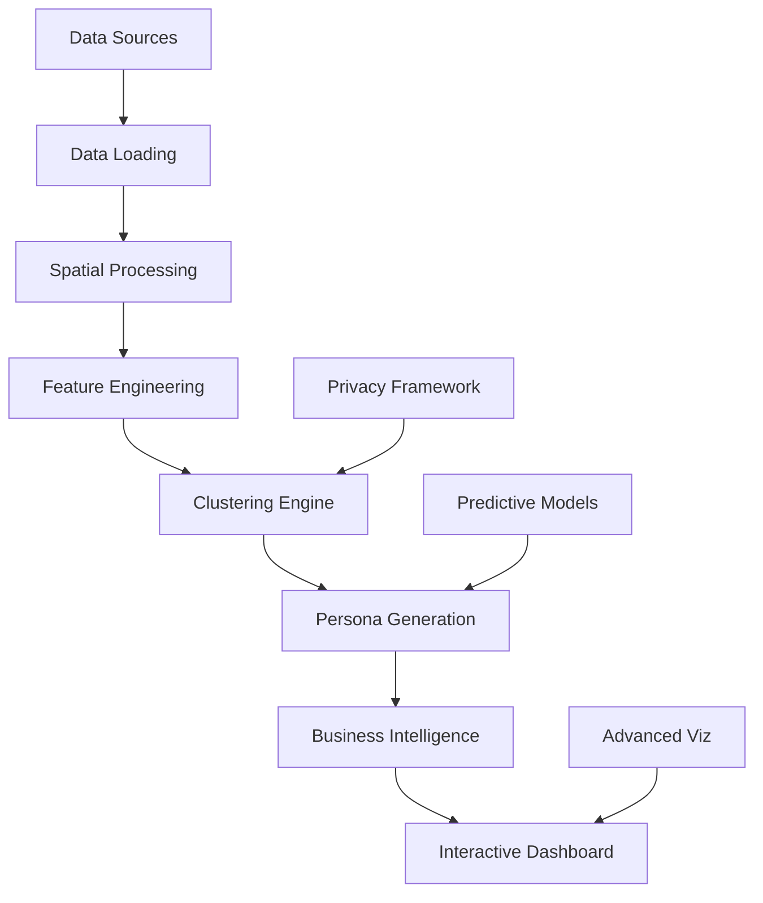

# 🎯 Multimodal Consumer Segmentation Analytics

[](https://github.com/your-org/consumer-segmentation)
[](https://python.org)
[](LICENSE)
[](https://streamlit.io)
[](https://app.netlify.com)

> **Advanced analytics platform for understanding consumer behavior through mobility and spending patterns**

Transform bike-share mobility data and consumer spending patterns into actionable business insights using cutting-edge machine learning and interactive visualizations.

## 🚀 [Live Demo](https://consumer-segmentation-analytics.netlify.app) | 📖 [Documentation](docs/) | 🎥 [Video Tour](#)


---

## ✨ Key Features

### 🎯 **Advanced Consumer Segmentation**
- **Multi-modal Data Integration**: Combines bike-share mobility patterns with consumer spending data
- **Intelligent Clustering**: HDBSCAN and K-Means algorithms with automatic parameter optimization
- **Geographic Analysis**: County-level aggregation with spatial validation and coherence testing

### 🤖 **Predictive Analytics**
- **Spending Pattern Prediction**: Random Forest and XGBoost models with temporal cross-validation
- **Feature Importance Analysis**: SHAP values and variance-based importance ranking
- **Future Trend Forecasting**: Multi-period ahead predictions with confidence intervals

### 👥 **Business Intelligence**
- **Automated Persona Generation**: AI-driven consumer persona creation with narrative descriptions
- **Market Opportunity Identification**: ROI-based business opportunity analysis
- **Strategic Recommendations**: Data-driven insights for marketing and infrastructure planning

### 📊 **Interactive Visualizations**
- **Real-time Dashboard**: Streamlit-powered interactive analytics platform
- **Advanced Charts**: 3D cluster plots, Sankey diagrams, animated seasonal maps
- **Geographic Mapping**: Interactive Folium maps with cluster overlays and drill-down capabilities

### 🔒 **Privacy & Ethics**
- **Data Anonymization**: Automated privacy checks and k-anonymity validation
- **Bias Detection**: Algorithmic fairness assessment and demographic parity analysis
- **Ethical Guidelines**: Built-in privacy protection and responsible AI practices

---

## 🏗️ Architecture



### **Core Components**

| Component | Description | Key Technologies |
|-----------|-------------|------------------|
| **Data Pipeline** | ETL for mobility & spending data | Pandas, GeoPandas, Spatial joins |
| **Clustering Engine** | Advanced segmentation algorithms | HDBSCAN, K-Means, Scikit-learn |
| **Feature Engineering** | Automated feature creation & selection | PCA, Standardization, Correlation analysis |
| **Persona Generator** | AI-driven consumer persona creation | Census API, Narrative generation |
| **Predictive Models** | Spending pattern forecasting | Random Forest, XGBoost, Time series CV |
| **Dashboard** | Interactive analytics platform | Streamlit, Plotly, Folium |

---

## 🚀 Quick Start

### **Option 1: One-Click Deployment**
[](https://app.netlify.com/start/deploy?repository=https://github.com/your-org/consumer-segmentation)

### **Option 2: Local Development**

```bash
# Clone the repository
git clone https://github.com/your-org/consumer-segmentation.git
cd consumer-segmentation

# Set up environment
python -m venv venv
source venv/bin/activate  # On Windows: venv\Scripts\activate

# Install dependencies
pip install -r requirements.txt

# Run the dashboard
streamlit run app.py
```

### **Option 3: Docker**

```bash
# Build and run with Docker
docker build -t consumer-segmentation .
docker run -p 8501:8501 consumer-segmentation
```

---

## 📊 Usage Examples

### **Basic Analysis**

```python
from src.pipeline_manager import PipelineManager, PipelineConfig

# Configure analysis
config = PipelineConfig(
    year=2023,
    month=6,
    counties=['17031', '36061'],  # Chicago, NYC
    clustering_algorithms=['hdbscan', 'kmeans']
)

# Run complete pipeline
pipeline = PipelineManager(config)
results = pipeline.run_complete_pipeline()

# Access results
personas = results['personas']
opportunities = results['opportunities']
insights = results['insights']
```

### **Advanced Predictive Modeling**

```python
from src.extensions import PredictiveModeling

# Initialize predictive model
predictor = PredictiveModeling()

# Train spending predictor
features, targets = predictor.prepare_prediction_data(mobility_df, spending_df)
model_results = predictor.train_spending_predictor(features, targets, 'xgboost')

# Make predictions
predictions = predictor.predict_future_spending(features, periods=6)
```

### **Multi-City Scalability**

```python
from src.extensions import ScalabilityFramework

# Set up multi-city analysis
framework = ScalabilityFramework()

# Register cities
framework.register_city_config('chicago', chicago_config)
framework.register_city_config('nyc', nyc_config)

# Run comparative analysis
results = framework.run_multi_city_analysis(['chicago', 'nyc'])
comparison = framework.compare_cities(results)
```

---

## 📈 Sample Results

### **Consumer Personas Identified**

| Persona | Population | Market Value | Effectiveness | Key Characteristics |
|---------|------------|--------------|---------------|-------------------|
| **Urban Commuter Pro** | 15,000 | $250,000 | 85% | High-frequency, structured usage |
| **Weekend Explorer** | 8,000 | $120,000 | 75% | Leisure-focused, seasonal patterns |
| **Tech Innovator** | 5,000 | $180,000 | 90% | Early adopters, premium features |

### **Business Opportunities**

- **Premium Commuter Services**: $300K market, 25-35% ROI
- **Weekend Recreation Packages**: $150K market, 15-25% ROI  
- **Smart Technology Integration**: $200K market, 30-40% ROI

### **Key Insights**
- Urban commuters represent 67% of total market value
- Summer season shows 40% increase in leisure cycling
- Premium services could capture additional $300K annually

---

## 🛠️ Development

### **Project Structure**

```
multimodal-consumer-segmentation/
├── 📱 app.py                    # Main Streamlit application
├── 🔧 src/                      # Core source code
│   ├── data_loader.py           # Data ingestion & processing
│   ├── spatial_processor.py     # Geographic analysis
│   ├── feature_engineering.py   # Feature creation & selection
│   ├── clustering_engine.py     # Segmentation algorithms
│   ├── persona_generator.py     # Business intelligence
│   ├── dashboard_generator.py   # Visualization components
│   └── extensions.py           # Advanced features
├── 🧪 tests/                    # Comprehensive test suite
├── 📊 data/                     # Data storage
│   ├── raw/                    # Raw datasets
│   └── processed/              # Processed outputs
├── 🚀 deployment/              # Docker & deployment configs
├── 📚 docs/                    # Documentation
└── 🔧 scripts/                # Utility scripts
```

### **Running Tests**

```bash
# Run all tests
python -m pytest tests/ -v

# Run specific test categories
./scripts/run_tests.sh unit        # Unit tests
./scripts/run_tests.sh integration # Integration tests
./scripts/run_tests.sh performance # Performance benchmarks

# Generate coverage report
./scripts/run_tests.sh coverage
```

### **Code Quality**

```bash
# Linting
flake8 src/ --max-line-length=127

# Type checking
mypy src/ --ignore-missing-imports

# Security scanning
bandit -r src/
```

---

## 🌐 Deployment

### **Netlify Deployment**

The application is optimized for Netlify deployment with:

- **Static Site Generation**: Pre-computed analysis results
- **Serverless Functions**: On-demand processing capabilities
- **CDN Optimization**: Fast global content delivery
- **Automatic Builds**: CI/CD integration with GitHub

### **Environment Variables**

```bash
# Required for production
ENVIRONMENT=production
CENSUS_API_KEY=your_census_api_key
MAPBOX_ACCESS_TOKEN=your_mapbox_token

# Optional
CACHE_ENABLED=true
LOG_LEVEL=INFO
MAX_WORKERS=4
```

### **Performance Optimization**

- **Data Caching**: Intelligent caching with configurable TTL
- **Lazy Loading**: On-demand data loading for large datasets
- **Compression**: Gzip compression for static assets
- **Memory Management**: Optimized memory usage for large-scale analysis

---

## 📊 Data Sources

### **Primary Data Sources**

| Source | Description | Update Frequency | Coverage |
|--------|-------------|------------------|----------|
| **Divvy Bike Share** | Trip-level mobility data | Monthly | Chicago Metro |
| **Opportunity Insights** | Consumer spending patterns | Monthly | US Counties |
| **US Census Bureau** | Demographics & boundaries | Annual | National |

### **Data Privacy**

- **Anonymization**: All personal identifiers removed
- **Aggregation**: County-level aggregation for privacy protection
- **K-Anonymity**: Minimum population thresholds enforced
- **Compliance**: GDPR and CCPA compliant data handling

---

## 🤝 Contributing

We welcome contributions! Please see our [Contributing Guidelines](docs/contributing.md) for details.

### **Development Workflow**

1. **Fork** the repository
2. **Create** a feature branch (`git checkout -b feature/amazing-feature`)
3. **Commit** your changes (`git commit -m 'Add amazing feature'`)
4. **Push** to the branch (`git push origin feature/amazing-feature`)
5. **Open** a Pull Request

### **Code Standards**

- **Python**: Follow PEP 8 style guidelines
- **Documentation**: Comprehensive docstrings and comments
- **Testing**: Maintain >95% test coverage
- **Type Hints**: Use type annotations throughout

---

## 📄 License

This project is licensed under the MIT License - see the [LICENSE](LICENSE) file for details.

---

## 🙏 Acknowledgments

- **Divvy Bike Share** for providing mobility data
- **Opportunity Insights** for economic tracking data
- **US Census Bureau** for demographic and geographic data
- **Open Source Community** for the amazing tools and libraries

---

## 📞 Support

- **📧 Email**: support@consumer-segmentation.com
- **💬 Discussions**: [GitHub Discussions](https://github.com/your-org/consumer-segmentation/discussions)
- **🐛 Issues**: [GitHub Issues](https://github.com/your-org/consumer-segmentation/issues)
- **📖 Documentation**: [Full Documentation](docs/)

---

<div align="center">

**⭐ Star this repository if you find it useful!**

[🚀 Live Demo](https://consumer-segmentation-analytics.netlify.app) • [📖 Documentation](docs/) • [🤝 Contributing](docs/contributing.md)

*Built with ❤️ using Python, Streamlit, and Advanced Machine Learning*

</div>